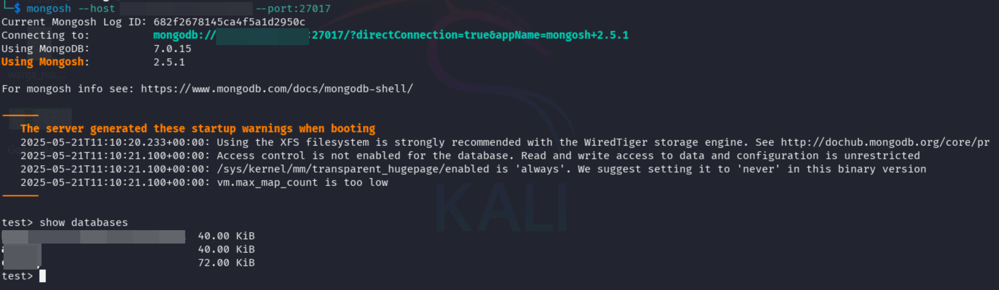

# 🔍 MongoSweep - MongoDB Instance Scanner & Enumerator

A powerful Python script for scanning and enumerating MongoDB instances.

## Features

- 🔍 Automatic mongosh installation check and OS-specific download guidance
- 🌐 Support for single target and bulk scanning
- 🔐 Database enumeration and information gathering

## Requirements

- Python 3.6+
- mongosh (MongoDB Shell)
- requests library
- Shodan API key (optional, for instance discovery)

## Installation

1. Clone the repository:
```bash
git clone https://github.com/yourusername/mongodb-scanner.git
cd mongodb-scanner
```

2. Install the required Python packages:
```bash
pip install -r requirements.txt
```

3. Install mongosh from [MongoDB's website](https://www.mongodb.com/try/download/shell)

### Shodan query

```
port:27017 product:"MongoDB" +"MongoDB Server Information"
```

## Usage

### Basic Scanning

#### Scan a single target:
```bash
python mongodb_scanner.py -t localhost:27017
```

#### Scan multiple targets from a file:
```bash
python mongodb_scanner.py -l targets.txt
```

## Example Output

```
[+] Successfully connected to localhost:27017
Databases found:
admin   0.000GB
config  0.000GB
local   0.000GB
test    0.000GB
```
## example command connect to and interact with MongoDB instances

```bash
mongosh --host <ip> --port:27017
```


## Security Considerations

⚠️ **Important Security Notes:**

1. Only scan systems you have permission to test
2. This tool is for security research and system administration purposes only
3. Unauthorized scanning may be illegal in some jurisdictions
4. Always follow responsible disclosure practices
